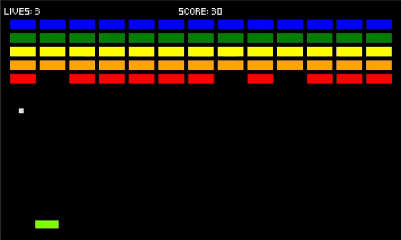
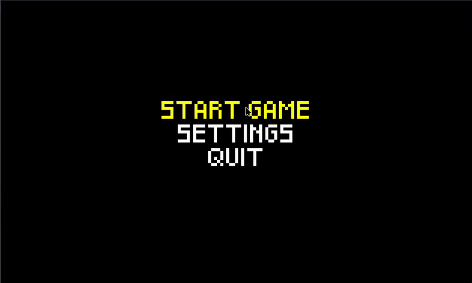
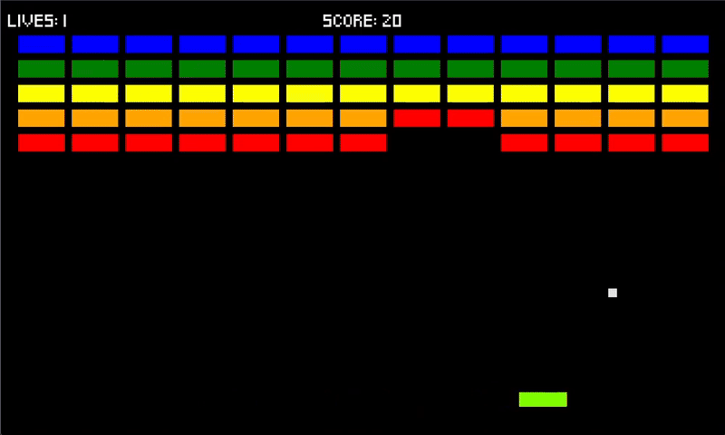

# Breakout Game (Python/Pygame)

Game 2 in the [20 Games Challenge](https://20_games_challenge.gitlab.io/challenge/)
A classic Breakout clone made in Python using Pygame. The game is heavily inspired by the original arcade version, with a paddle, bouncing ball, and destructible bricks.
### Features
- Retro-style gameplay and graphics using simple rectangles
- Paddle movement with keyboard controls
- Paddle width changes as ball moves up and down
- 5 rows of bricks to destroy, with each row a different color and toughness amount
- Scoring system
- Fully implemented game loop with start, play, and game over states

### Controls
- Left Arrow / A  -  Move paddle left
- Right Arrow / D  -  Move paddle right
- Q  -  Quit Game
- Escape  -  Quit to main menu







### Project Structure
```
breakout/
│
├─ menus/
│  ├─ game_over_menu.py
│  └─ main_menu.py
│  └─ menu.py
│  └─ settings_menu.py
├─ sprites/
│  └─ __init__.py
│  └─ ball.py
│  └─ brick.py
│  └─ paddle.py
├─ constants.py
├─ game.py
├─ settings.py
└─ main.py
```

Game Font: [Pixeled](https://www.dafont.com/pixeled.font) 